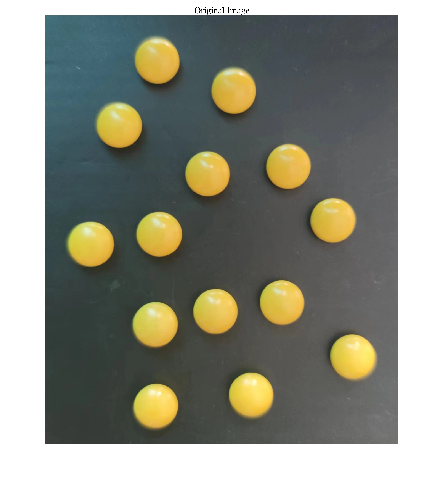
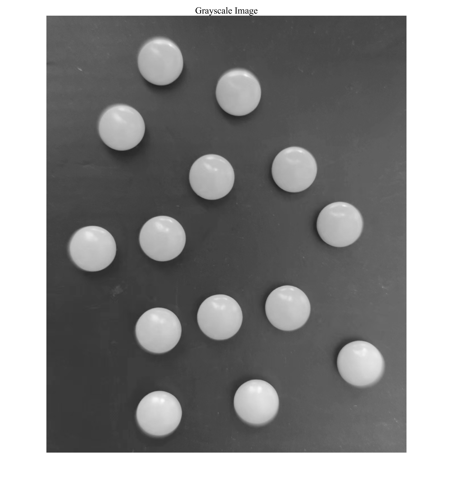
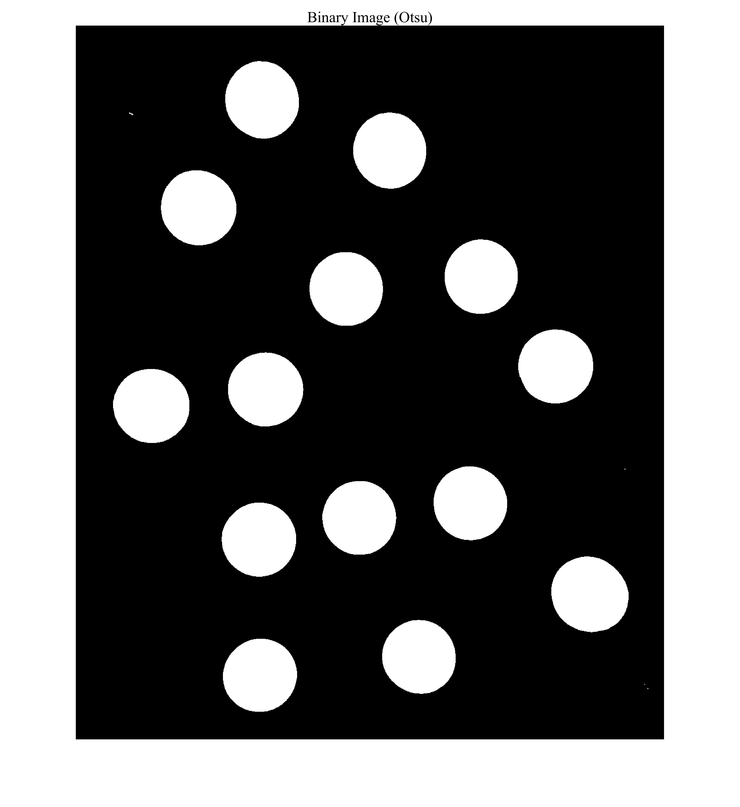
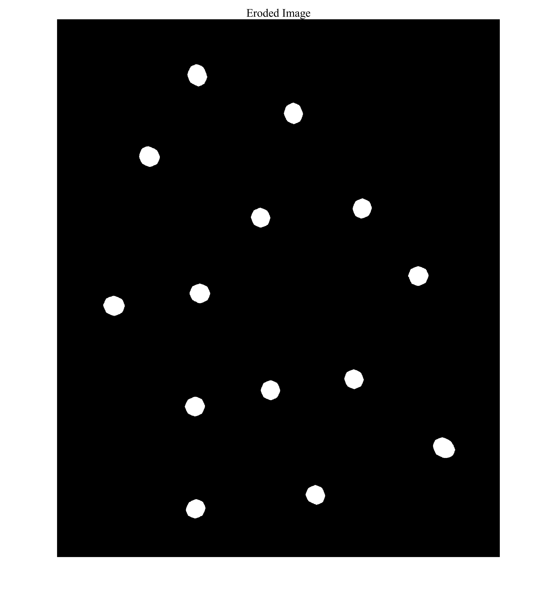
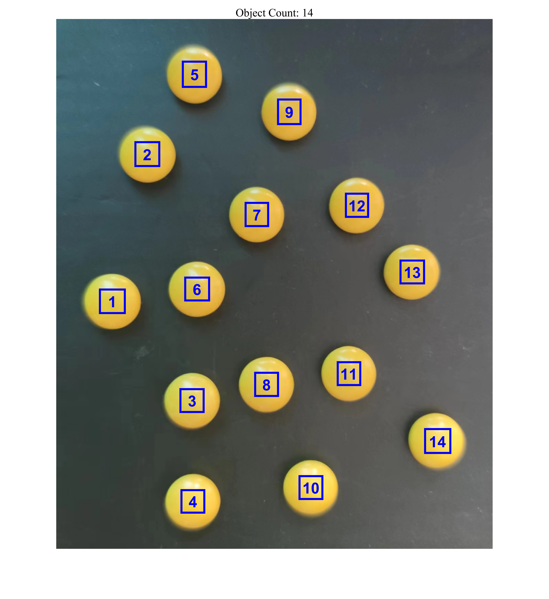

# MATLAB 图像处理之图像内物体计数仿真 / MATLAB Image Processing: Object Counting in Images

## 1. 原理概述 / Principle

图像内物体计数是图像处理中的经典问题。本仿真通过一系列图像处理步骤实现自动计数：读取彩色图像后，转换为灰度图、中值滤波去噪、Otsu 二值化、形态学腐蚀分离粘连物体、膨胀恢复物体形状、连通区域标记，最后绘制边界框并标注编号。该方法适用于背景清晰、物体形状规则的图像。

Object counting in images is a classic problem in image processing. This simulation implements automated counting through a series of image processing steps: reading a color image, converting to grayscale, median filtering for denoising, Otsu thresholding, morphological erosion to separate touching objects, dilation to restore object shapes, connected component labeling, and finally drawing bounding boxes with labels. This method is suitable for images with clear backgrounds and regularly shaped objects.

### 核心公式 / Core Equations

**Otsu 阈值 / Otsu Thresholding:**

$$
\sigma_B^2(t) = \omega_1(t)\omega_2(t)[\mu_1(t) - \mu_2(t)]^2
$$

其中 $t$ 为阈值，$\omega_1$、$\omega_2$ 分别为目标和背景的像素比例，$\mu_1$、$\mu_2$ 分别为其均值。最优阈值 $t^*$ 使类间方差 $\sigma_B^2$ 最大。

where $t$ is the threshold, $\omega_1$, $\omega_2$ are the pixel proportions of foreground and background, and $\mu_1$, $\mu_2$ are their means. The optimal threshold $t^*$ maximizes the between-class variance $\sigma_B^2$.

**形态学操作 / Morphological Operations:**

腐蚀（Erosion）：$(f \ominus b)(x) = \min_{y \in b} f(x + y)$

膨胀（Dilation）：$(f \oplus b)(x) = \max_{y \in b} f(x - y)$

其中 $b$ 为结构元素。

where $b$ is the structuring element.

---

## 2. 关键参数 / Key Parameters

| 参数 / Parameter | 符号 / Symbol | 值 / Value | 说明 / Description |
|------|------|------|------|
| 中值滤波窗口 | - | 3 $\times$ 3 | 去噪窗口大小 / Median filter window |
| 腐蚀结构元素 | - | disk, r = 50 | 圆形结构元素半径 / Disk structuring element radius |
| 膨胀结构元素 | - | diamond, 5 | 菱形结构元素大小 / Diamond structuring element size |
| 输入图像 | - | img.jpg | RGB 彩色图像 / Input RGB image |

---

## 3. 仿真结果 / Simulation Results

> 处理流程：原始图像 $\rightarrow$ 灰度 $\rightarrow$ 中值滤波 $\rightarrow$ 二值化 $\rightarrow$ 腐蚀 $\rightarrow$ 膨胀 $\rightarrow$ 连通区域标记
>
> Pipeline: original $\rightarrow$ grayscale $\rightarrow$ median filter $\rightarrow$ binarization $\rightarrow$ erosion $\rightarrow$ dilation $\rightarrow$ connected component labeling

### 3.1 原始图像 / Original Image

### 3.2 灰度图像 / Grayscale Image

### 3.3 中值滤波后图像 / Filtered Image (Median 3x3)

### 3.4 二值图像 / Binary Image (Otsu)

### 3.5 腐蚀后图像 / Eroded Image

### 3.6 膨胀后图像 / Dilated Image

### 3.7 最终结果 / Final Result (Bounding Boxes & Count)

---

*更多算法请返回 [F:\GitHub](../../README.md).*
